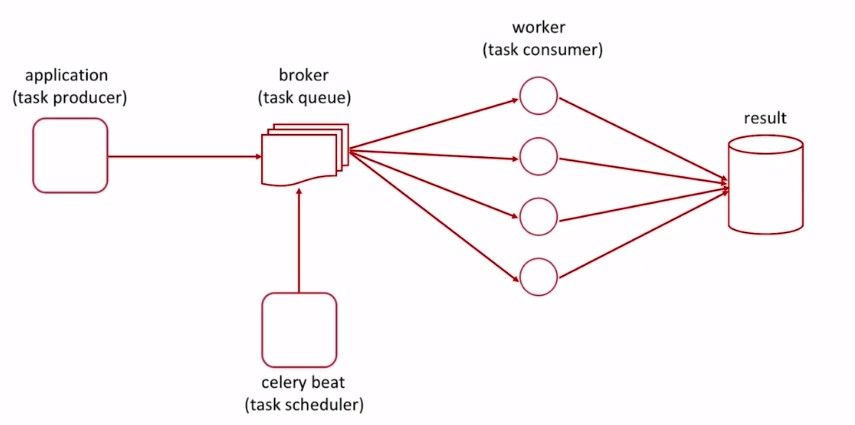
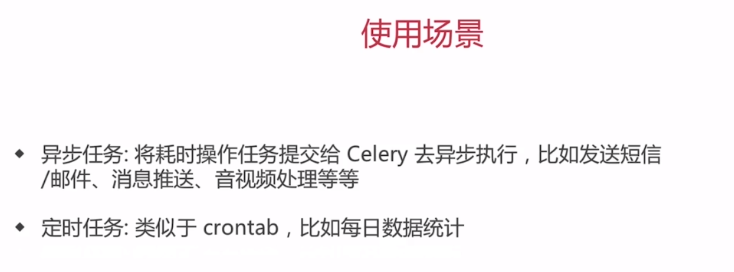

## 1. 使用celery

异步任务
----

```bash
# 1. 启动 celery worker
celery worker -A celery_app -l INFO

# 2. 运行 python 代码
python app.py
```

计时器
----

```bash
# 1. 启动celery worker
celery worker -A celery_app -l INFO

# 2. 开启celery计时器进程
celery beat -A celery_app -l INFO

# 3. 一条命令执行上面两步(windows上面不可以)
celery -B -A celery_app worker -l INFO
```

> celery 4.1.0 时区有bug，需要回退或者升级版本


## 2. Django中使用celery

安装
---

```bash
pip install django-celery
```

启动
----

```bash
python manage.py celery worker -l INFO
python manage.py runserver
python manage.py celery beat -l INFO
```

## 3. 监控工具 flower

安装
---

```bash
pip install flower
```

启动
----

```bash
# 先启动worker
python manage.py celery worker -l INFO
# 再启动flower，访问 localhost:5555 控制台
python manage.py celery flower
# python manage.py celery flower --address=0.0.0.0 --port=5555 --basic_auth=admin:admin123 -l INFO

# 启动定时器任务
python manage.py celery beat -l INFO 
```

## 4. 进程管理 supervisor
